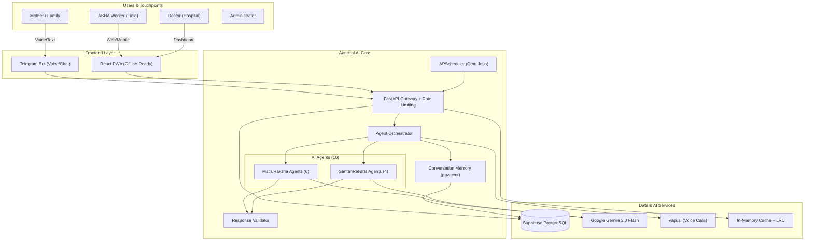

# 🏥 Aanchal AI

> **"Protecting Mothers, Nurturing Futures"**

**Aanchal AI** is a comprehensive digital health ecosystem designed to combat maternal and infant mortality by bridging the gap between rural healthcare workers (ASHAs), doctors, and families. It powers two specialized AI-driven modules in one unified platform:

1. **MatruRaksha** 🤰 — **Maternal Health** (Pregnancy to Postpartum)
2. **SantanRaksha** 👶 — **Child Health** (Neonatal to Infant care, 0–5 years)

By leveraging Artificial Intelligence (Google Gemini 2.0 Flash), real-time data analytics, and a multi-channel approach (Web + Telegram + Voice), Aanchal AI ensures no mother or child is left behind.


---

## 🌟 Key Features

### 🔐 Secure & Flexible Access

* **Role-Based Access Control**: Specialized dashboards for **Doctors**, **ASHA Workers**, and **Admin**.
* **Google OAuth Integration**: Seamless one-tap sign-up/login.
* **Profile Completion Flow**: Intelligent flow for new social logins to capture critical medical/role details.
* **Admin Approval Strategy**: Strict verification process for healthcare professionals (ID & Certificate checks).
* **Sanitized Error Responses**: All API errors are sanitized to prevent internal detail leakage.
* **API Rate Limiting**: Global rate limiting (100 req/min) via `slowapi` to prevent abuse and DDoS.
* **Fernet Password Encryption**: Registration passwords are encrypted with a cryptographically secure Fernet key.

### 🤖 Intelligent AI Agent Swarm (Powered by Gemini)

The system employs **10 specialized agents** orchestrated to handle specific health domains:

| Agent | Domain | Key Capabilities |
|-------|--------|------------------|
| **Care Agent** | Pregnancy wellness | Trimester-specific advice, symptom guidance |
| **Emergency Agent** | Urgent situations | Severity-weighted detection, multilingual emergency keywords |
| **Nutrition Agent** | Maternal diet | Personalized plans, anaemia management |
| **Risk Agent** | Complications | Preeclampsia, GDM, high-risk assessment |
| **Medication Agent** | Drug safety | Pregnancy-safe medications, dosage info |
| **ASHA Agent** | Community health | Appointments, local resources, referrals |
| **Postnatal Agent** | Post-delivery care | Lochia tracking, breastfeeding, PPD screening (EPDS) |
| **Pediatric Agent** | Child illness | IMNCI protocols, fever/diarrhea/pneumonia management |
| **Vaccine Agent** | Immunization | IAP 2023 schedule tracking, side effects |
| **Growth Agent** | Child growth | WHO z-scores, feeding guidance, malnutrition detection |

**Orchestrator Intelligence:**

* 🎯 **3-tier classification**: Keyword scoring → AI fallback → system routing (based on delivery status)
* 🧠 **Conversation Memory**: Semantic search via Supabase pgvector for follow-up context
* ✅ **Response Validation**: Clinical safety checks (IMNCI compliance, citation enforcement)
* 💰 **Cost Optimization**: LRU classification cache (5-min TTL), `gemini-2.0-flash` for routing, optimized prompts

### 📱 Telegram Bot & Voice Assistance

* **Conversational AI**: Mothers can chat naturally in their local language (Hindi, Marathi, English).
* **Voice-First Interface**:
  * **Speech-to-Text**: Users can send voice notes which are transcribed by Gemini.
  * **Text-to-Speech**: AI replies with audio messages (with language detection) for accessibility.
* **Document Analysis**: Upload medical reports (PDF/Images) directly in chat for instant AI summarization and risk flagging via **Gemini 2.0 Flash Vision**.
* **Multi-Profile Management**: ASHAs can manage multiple mothers from a single Telegram account.
* **Postnatal Context**: Bot automatically includes child data (vaccinations, growth, assessments) for delivered mothers.
* **Global Query Caching**: Identical questions from different mothers are served instantly from an in-memory TTL cache, cutting Gemini API costs.
* **Daily User Throttling**: 20-message-per-day rate limit per user to prevent abuse.

### 📊 Comprehensive Dashboards

* **Admin Panel**:
  * **Overview**: Quick summary stats — fully assigned, needs assignment, active doctors/ASHAs.
  * **📈 Analytics Tab**: AI Token usage estimates, USD cost tracker, and a **Word Cloud** of common risk topics from case discussions.
  * **Mothers Tab**: Track delivery status, risk levels, and due dates with inline ASHA/Doctor assignment.
  * **Children Tab**: Manage pediatric records, growth charts, and vaccinations.
  * **User Management**: Approve/Reject doctor and ASHA registrations.
* **ASHA Dashboard**:
  * **Vaccination Calendar**: IAP 2023 schedule with Mark Done tracking per child.
  * **Postnatal Assessments**: Record mother & child health check-ins.
  * **Growth Monitoring**: Record weight/height/HC with WHO z-score calculations.

### 🤖 Proactive AI & Automation

* **APScheduler Background Cron Jobs**: Automated daily and weekly AI-driven tasks integrated into the FastAPI lifespan:
  * **Weekly Assessments** — Monday 09:00 AM
  * **Milestone Reminders** — Daily 10:00 AM
  * **Vaccination Reminders** — Daily 09:30 AM
  * **Daily Check-in Reminders** — Daily 08:00 AM
* **Async Document Processing**: Medical report analysis runs via FastAPI `BackgroundTasks` so the main thread stays responsive.

### 📱 Progressive Web App (PWA)

* **Installable**: Rural ASHA workers can "Add to Home Screen" on any mobile device for a native-app-like experience.
* **Offline Support**: Service Worker caches static assets so the dashboard remains accessible even without internet.
* **Accessible**: ADA-compliant ARIA labels on all navigation elements for screen reader support.

---

## 🏗️ System Architecture



---

## 🛠️ Technology Stack

| Component | Technology | Description |
|-----------|------------|-------------|
| **AI Core** | **Google Gemini 2.0 Flash** | Multimodal LLM for reasoning, voice, and vision. **Includes auto-rotation across multiple API keys on rate limits.** |
| **Backend** | Python 3.12, FastAPI | High-performance async API with dynamic multi-CORS origin support. |
| **Frontend** | React 18, Vite | Responsive PWA dashboards with Recharts |
| **Mobile App** | Expo (React Native) | Unified mobile app deployable to iOS, Android, and Vercel (PWA) |
| **Database** | Supabase (PostgreSQL + pgvector) | Managed DB with Auth, Storage, and Vector search |
| **Messaging** | Telegram Bot API | Accessible interface for rural adoption |
| **Voice** | gTTS / Vapi.ai | Voice synthesis and telephony integration |
| **Caching** | Redis (optional) + In-memory LRU | API response caching and classification cache |
| **Rate Limiting** | slowapi | Global 100 req/min protection against abuse |
| **Scheduling** | APScheduler | Background cron jobs for automated AI check-ins |
| **Security** | Fernet (cryptography) | Password encryption with proper key management |

---

## ⚡ Quick Start Guide

### 1. Requirements

* Python 3.12+
* Node.js 18+
* Supabase Account
* Google Gemini API Key

### 2. Environment Setup

Create `.env` files in `backend/` and `frontend/` directories.

**Backend (.env):**

```env
SUPABASE_URL=your_url
SUPABASE_KEY=your_key
SUPABASE_SERVICE_ROLE_KEY=your_service_role_key
# You can supply up to 3 Gemini keys. Auto-rotates if one hits a 429 rate limit.
GEMINI_API_KEY=your_gemini_key
GEMINI_API_KEY_2=your_gemini_key_2
GEMINI_API_KEY_3=your_gemini_key_3
TELEGRAM_BOT_TOKEN=your_bot_token
PASSWORD_ENCRYPTION_KEY=your_fernet_key
BACKEND_URL=https://your-app.onrender.com
# Accepts comma-separated URLs for multi-origin support
FRONTEND_URL=https://your-website.vercel.app,https://your-mobile-app.vercel.app
USE_TELEGRAM_WEBHOOK=true
```

> **Tip:** Generate a proper Fernet key with:
>
> ```bash
> python -c "from cryptography.fernet import Fernet; print(Fernet.generate_key().decode())"
> ```

**Frontend (.env):**

```env
VITE_API_URL=http://localhost:8000
VITE_SUPABASE_URL=your_url
VITE_SUPABASE_ANON_KEY=your_anon_key
```

### 3. Database Setup

Run the SQL migration files in `infra/supabase/` in the following order using Supabase SQL Editor:

1. `infra/supabase/migration_santanraksha_v1.sql` (Core tables for Child Health)
2. `infra/supabase/migration_voice_features_v2.sql` (Voice & Consultation features)

### 4. Run Locally

**Backend:**

```bash
cd backend
python -m venv venv
source venv/bin/activate  # or venv\Scripts\activate on Windows
pip install -r requirements.txt
python main.py
```

**Frontend:**

```bash
cd frontend
npm install
npm run dev
```

**Mobile (Expo):**
```bash
cd mobile
npm install
npx expo start --web  # Run locally in browser
# OR
npx expo start        # Run in Expo Go on physical device
```

The APScheduler cron jobs (daily reminders, vaccination alerts, weekly assessments) start automatically with the FastAPI server.

### 5. Running Tests

```bash
pytest backend/tests/
```

### 6. Utility Scripts

Useful maintenance scripts in `backend/scripts/`:

* `check_users.py` — Verify user roles
* `fix_approved_users.py` — Fix approval status issues
* `verify_setup.py` — Check system configuration
* `reset_password.py` — Reset user passwords

---

## 🔒 Security

| Feature | Implementation |
|---------|---------------|
| **API Rate Limiting** | `slowapi` — 100 requests/minute globally |
| **CORS** | Scoped to known frontend origins only |
| **Admin Auth** | All `/admin/*` routes guarded by `require_admin` dependency |
| **Password Encryption** | Fernet symmetric encryption (not plaintext) |
| **Error Sanitization** | No internal stack traces leaked to clients |
| **Input Validation** | Pydantic models for all request bodies |
| **Response Validation** | Clinical safety checks on all AI outputs |

---

## 📚 Documentation

* [API Specification](docs/API_SPECIFICATION.md)
* [SantanRaksha (Child Health) Details](docs/SANTANRAKSHA.md)
* [Architecture](docs/architecture.md)

---

## 🤝 License

License: MIT
