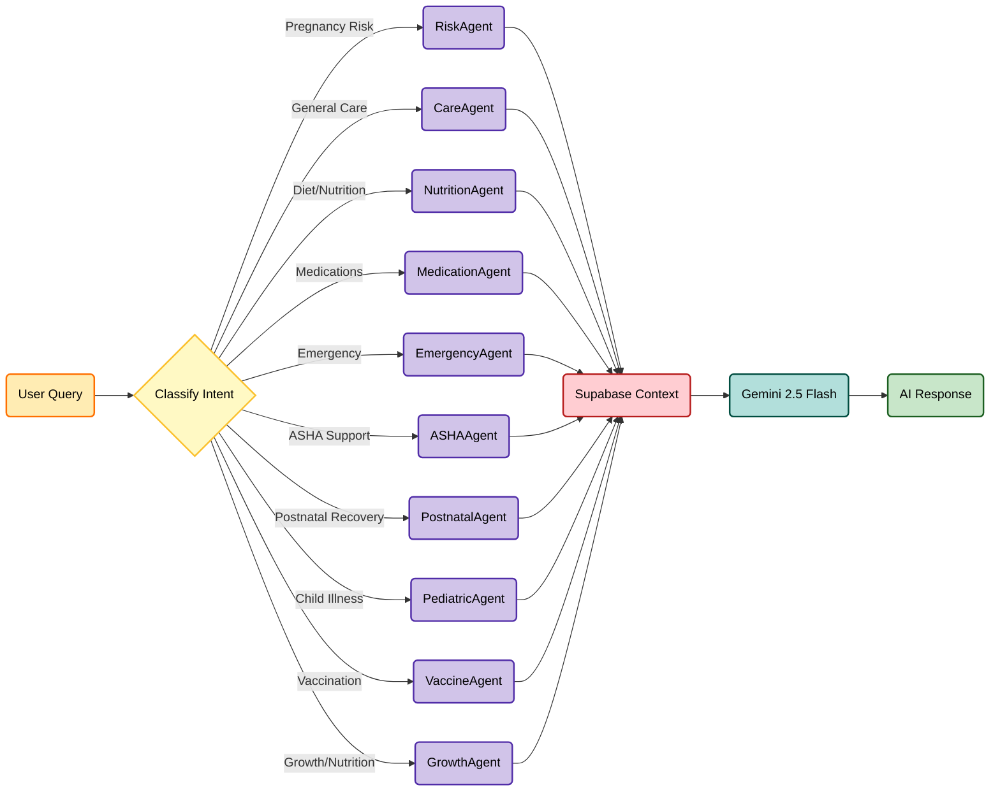
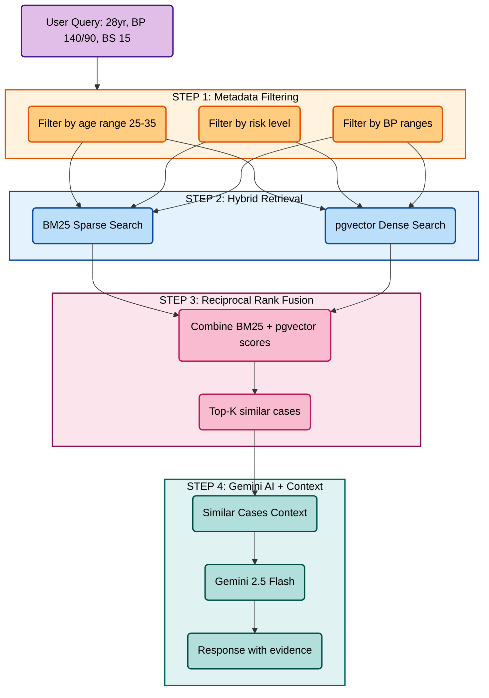
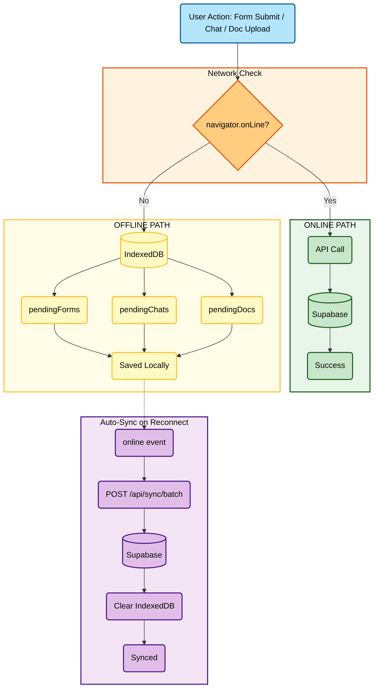
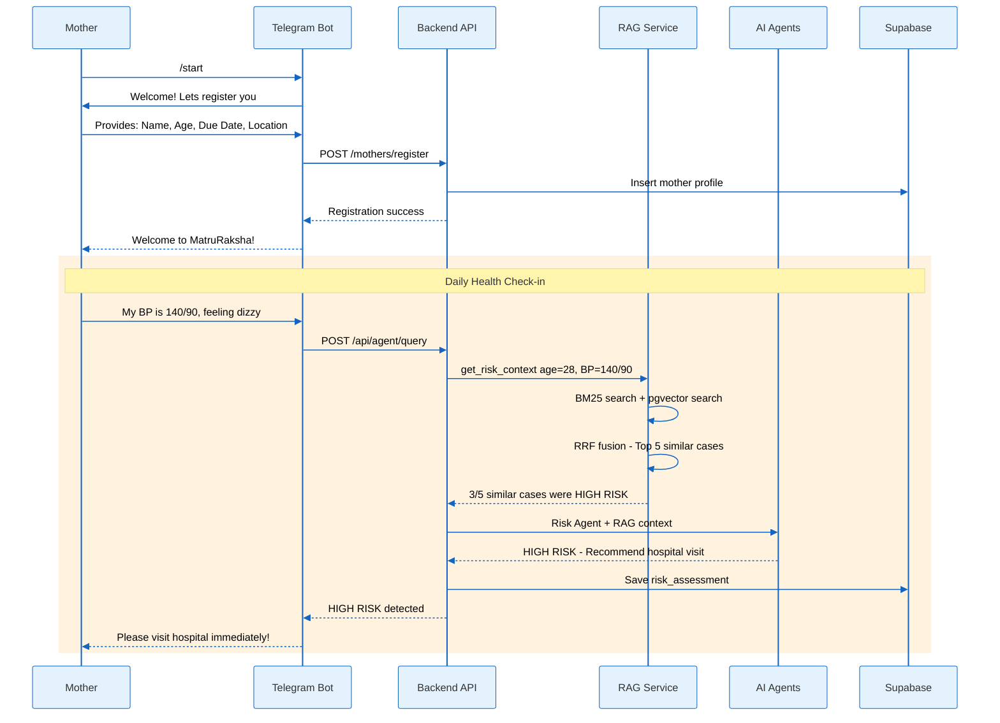
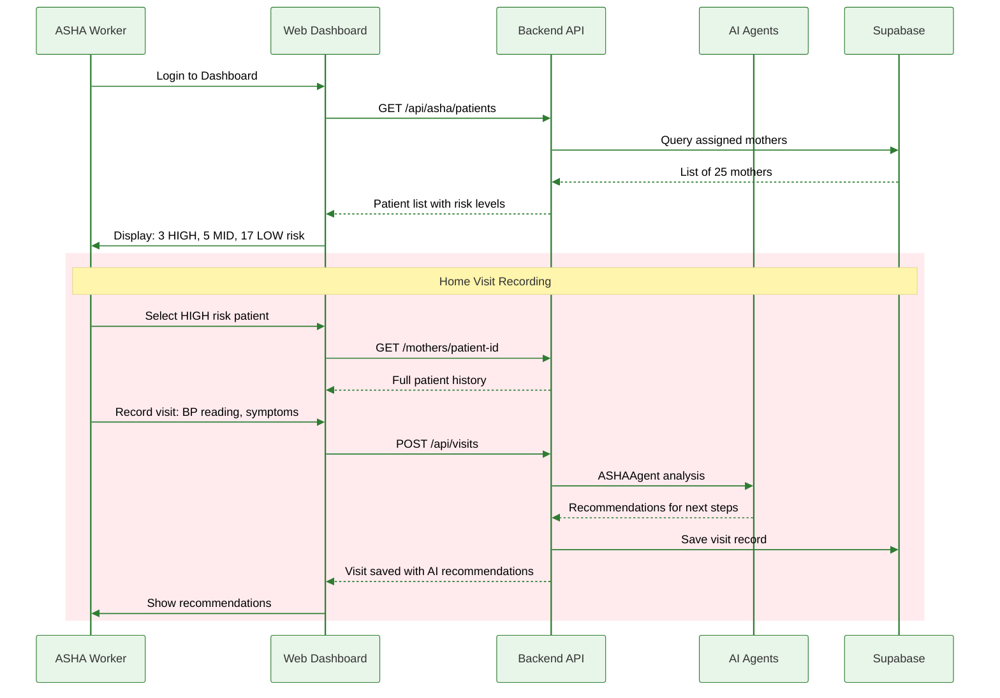
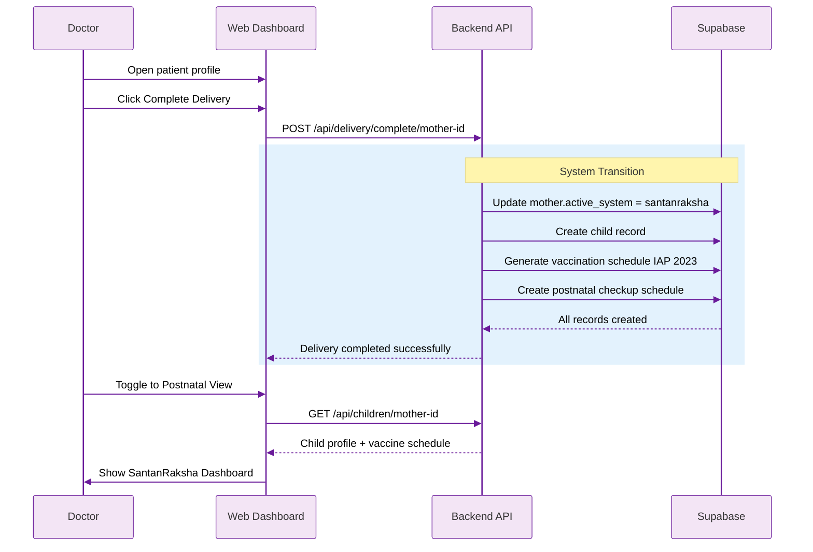
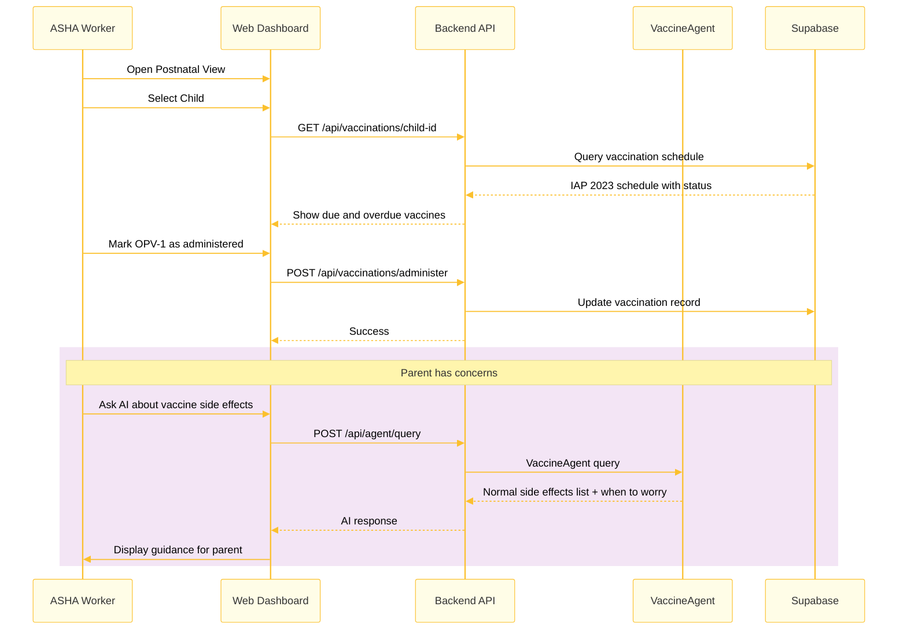

# 🤰 MatruRaksha AI + 🍼 SantanRaksha

> **Complete Maternal & Child Health Care System** - From Pregnancy to Postnatal Recovery & Child Development

[](https://www.python.org/)
[](https://fastapi.tiangolo.com/)
[](https://reactjs.org/)
[](https://supabase.com/)
[](https://ai.google.dev/)

---

## 🎯 Overview

This system provides **end-to-end maternal and child health care** through two integrated modules:

| Module | Focus | Features |
|--------|-------|----------|
| **🤰 MatruRaksha** | Pregnancy Care | Risk assessment, symptom tracking, AI health guidance |
| **🍼 SantanRaksha** | Postnatal & Child Care | Vaccination tracking, growth monitoring, milestone tracking |

### Target Users

| User | Access | Features |
|------|--------|----------|
| 🤰 **Mother** | Telegram Bot, Web | Health queries, check-ins, emergency alerts |
| 👩‍⚕️ **ASHA Worker** | Web Dashboard | Patient monitoring, visits, assessments, toggle between pregnancy/postnatal |
| 👨‍⚕️ **Doctor** | Web Dashboard | Case review, risk assessments, consultations, toggle between pregnancy/postnatal |
| 👨‍💼 **Admin** | Web Dashboard | User management, approvals |

---

## 🏗️ Complete Architecture

### High-Level System Design

```mermaid
graph TB
    %% Defined Styles
    classDef users fill:#ffecb3,stroke:#ff6f00,stroke-width:2px,color:black
    classDef frontend fill:#bbdefb,stroke:#0d47a1,stroke-width:2px,color:black
    classDef telegram fill:#e1bee7,stroke:#4a148c,stroke-width:2px,color:black
    classDef backend fill:#ffcdd2,stroke:#b71c1c,stroke-width:2px,color:black
    classDef ai fill:#d1c4e9,stroke:#512da8,stroke-width:2px,color:black
    classDef external fill:#b2dfdb,stroke:#004d40,stroke-width:2px,color:black
    classDef db fill:#c8e6c9,stroke:#1b5e20,stroke-width:2px,color:black

    subgraph USERS [👥 USERS]
        Mother(🤰 Mother):::users
        ASHA(👩‍⚕️ ASHA):::users
        Doctor(👨‍⚕️ Doctor):::users
        Admin(👨‍💼 Admin):::users
    end

    subgraph FRONTEND [🌐 FRONTEND - React + Vite]
        WebApp(Web Dashboard :5173):::frontend
        VoiceInput(🎤 Voice Input Module):::frontend
        LazyLoad(⚡ Code Splitting):::frontend
        OfflineSync(Offline Sync Service):::frontend
        IndexedDB[("IndexedDB")]:::frontend
    end

    subgraph TELEGRAM [📱 TELEGRAM]
        TGBot(MatruRaksha Bot <br/> *Async Threaded*):::telegram
    end

    subgraph BACKEND [⚙️ BACKEND - FastAPI Async]
        API(REST API :8000):::backend
        AsyncEngine(⚡ Async Context Engine):::backend
        Orchestrator(AI Orchestrator):::backend
        RAGService(Hybrid RAG Service):::backend
        SyncRoutes(Offline Sync Routes):::backend
    end

    subgraph AI_AGENTS [🤖 AI AGENTS SYSTEM]
        subgraph PREG [🤰 MATRURAKSHA - Pregnancy]
            style PREG fill:#fff3e0,stroke:#ff6f00,stroke-width:1px
            Risk(Risk Agent):::ai
            Care(Care Agent):::ai
            Nutrition(Nutrition Agent):::ai
            Medication(Medication Agent):::ai
            Emergency(Emergency Agent):::ai
            ASHAAgent(ASHA Agent):::ai
        end

        subgraph POST [🍼 SANTANRAKSHA - Postnatal]
            style POST fill:#e1f5fe,stroke:#0277bd,stroke-width:1px
            Postnatal(Postnatal Agent):::ai
            Pediatric(Pediatric Agent):::ai
            Vaccine(Vaccine Agent):::ai
            Growth(Growth Agent):::ai
        end
    end

    subgraph EXTERNAL [🔗 EXTERNAL SERVICES]
        Gemini(Gemini 2.0 Flash):::external
        GeminiEmbed(Gemini Embeddings):::external
        Resend(Resend Email):::external
    end

    subgraph DATABASE [🗄️ SUPABASE]
        PG[("PostgreSQL")]:::db
        pgvector[("pgvector")]:::db
        Auth(Supabase Auth):::db
        Storage[("File Storage")]:::db
        Cache[(⚡ In-Memory Cache)]:::db
    end

    Mother --> TGBot
    Mother --> WebApp
    ASHA --> WebApp
    Doctor --> WebApp
    Admin --> WebApp

    WebApp --> VoiceInput
    WebApp -.-> LazyLoad
    VoiceInput --> API
    TGBot --> API
    WebApp --> OfflineSync
    OfflineSync <--> IndexedDB
    OfflineSync --> API

    API --> AsyncEngine
    AsyncEngine --Parallel Fetch--> PG
    AsyncEngine --Parallel Fetch--> pgvector
    AsyncEngine --> Orchestrator
    
    Orchestrator --> Risk
    Orchestrator --> Care
    Orchestrator --> Nutrition
    Orchestrator --> Medication
    Orchestrator --> Emergency
    Orchestrator --> ASHAAgent
    Orchestrator --> Postnatal
    Orchestrator --> Pediatric
    Orchestrator --> Vaccine
    Orchestrator --> Growth
    
    RAGService --> GeminiEmbed
    RAGService --> pgvector
    
    Risk --> Gemini
    Care --> Gemini
    
    API --> PG
    API --> Auth
    API --> Storage
    API --> Resend
```



### AI Agent Orchestrator Flow



### Hybrid RAG System

Retrieval-Augmented Generation using 1,015 maternal health cases for context-aware AI responses.



### Offline-First Data Sync

Ensures forms, chats, and documents are never lost in low-connectivity areas.



---

## 🔄 User Flows

### Flow 1: Mother Registration and Risk Assessment



### Flow 2: ASHA Worker Daily Workflow



### Flow 3: Delivery to Postnatal Transition



### Flow 4: Vaccination Tracking



---

## 🤖 AI Agents (10 Total)

### MatruRaksha Agents (6)

| Agent | Purpose |
|-------|---------|
| **RiskAgent** | Pregnancy risk assessment |
| **CareAgent** | General prenatal care guidance |
| **NutritionAgent** | Diet and nutrition advice |
| **MedicationAgent** | Safe medication guidance |
| **EmergencyAgent** | Emergency detection and escalation |
| **ASHAAgent** | ASHA worker support |

### SantanRaksha Agents (4)

| Agent | Purpose | Standards |
|-------|---------|-----------|
| **PostnatalAgent** | Mother's recovery (0-6 weeks) | NHM SUMAN, EPDS |
| **PediatricAgent** | Child illness assessment | IMNCI |
| **VaccineAgent** | Immunization guidance | IAP 2023 |
| **GrowthAgent** | Growth & nutrition monitoring | WHO, RBSK |

---

## 📋 Clinical Standards

| Standard | Application |
|----------|-------------|
| **IAP 2023** | 19 vaccines from birth to 2 years |
| **WHO Growth Standards** | Z-score classification for weight/height |
| **RBSK 4Ds** | Developmental screening (Defects, Diseases, Deficiencies, Delays) |
| **NHM SUMAN** | Postnatal care - 6 checkups in 42 days |
| **IMNCI** | Integrated child illness management |
| **WHO IYCF** | Infant feeding recommendations |

---

## 🚀 Quick Start

### 1. Backend Setup

```bash
cd backend

# Create virtual environment
python -m venv venv
venv\Scripts\activate  # Windows
source venv/bin/activate  # Linux/Mac

# Install dependencies
pip install -r requirements.txt

# Create .env file
GEMINI_API_KEY=your_gemini_key
SUPABASE_URL=your_supabase_url
SUPABASE_KEY=your_supabase_key
TELEGRAM_BOT_TOKEN=your_bot_token

# Run server
python main.py
```

### 2. Frontend Setup

```bash
cd frontend

# Install dependencies
npm install

# Create .env.local
VITE_SUPABASE_URL=your_supabase_url
VITE_SUPABASE_ANON_KEY=your_supabase_anon_key
VITE_API_URL=http://localhost:8000

# Run dev server
npm run dev
```

### 3. Access the App

- **Frontend**: <http://localhost:5173>
- **Backend API**: <http://localhost:8000>
- **API Docs**: <http://localhost:8000/docs>

---

## 📁 Project Structure

```
SantanRaksha/
├── README.md                     # This file
├── CHANGELOG.md                  # Version history
├── SANTANRAKSHA.md               # SantanRaksha detailed docs
│
├── backend/
│   ├── agents/
│   │   ├── orchestrator.py       # Routes to correct agent
│   │   ├── risk_agent.py         # Pregnancy risk
│   │   ├── care_agent.py         # General care
│   │   ├── nutrition_agent.py    # Diet advice
│   │   ├── medication_agent.py   # Safe meds
│   │   ├── emergency_agent.py    # Emergencies
│   │   ├── asha_agent.py         # ASHA support
│   │   ├── postnatal_agent.py    # Postnatal recovery
│   │   ├── pediatric_agent.py    # Child illness
│   │   ├── vaccine_agent.py      # Vaccinations
│   │   └── growth_agent.py       # Growth tracking
│   ├── routes/
│   │   ├── delivery.py           # Delivery completion API
│   │   └── ...
│   ├── services/
│   │   └── rag_service.py        # Hybrid RAG
│   ├── main.py                   # FastAPI app
│   └── telegram_bot.py           # Telegram integration
│
├── frontend/
│   ├── src/
│   │   ├── components/
│   │   │   ├── Navbar.jsx        # With view toggle
│   │   │   └── ViewToggle.jsx    # Toggle component
│   │   ├── contexts/
│   │   │   ├── AuthContext.jsx   # Authentication
│   │   │   └── ViewContext.jsx   # View state (pregnancy/postnatal)
│   │   ├── pages/
│   │   │   ├── ASHAInterface.jsx # ASHA dashboard
│   │   │   ├── DoctorDashboard.jsx # Doctor dashboard
│   │   │   └── postnatal/        # SantanRaksha pages
│   │   │       ├── PostnatalDashboard.jsx
│   │   │       ├── ChildrenList.jsx
│   │   │       ├── VaccinationCalendar.jsx
│   │   │       ├── GrowthCharts.jsx
│   │   │       └── MilestonesTracker.jsx
│   │   └── ...
│   └── ...
│
├── docs/
│   └── API_SPECIFICATION.md      # Full API reference
│
└── infra/
    └── supabase/
        ├── migration_santanraksha_v1.sql  # Children, vaccines, growth tables
        └── migration_delivery_switch.sql  # Delivery completion logic
```

---

## 🔄 User Flow

### Pregnancy → Delivery → Postnatal

```
1. Mother registers via Telegram/Web
       ↓
2. ASHA/Doctor manages in MatruRaksha (Pregnancy View)
       ↓
3. Delivery completed → API call switches to SantanRaksha
       ↓
4. ASHA/Doctor toggles to Postnatal View
       ↓
5. Track vaccinations, growth, milestones
```

### Toggle Usage

1. Login as ASHA Worker or Doctor
2. Go to dashboard (`/asha` or `/doctor`)
3. Find toggle in **blue navigation bar**
4. Click **"🍼 Postnatal"** to switch views
5. Click **"🤰 Pregnancy"** to switch back

---

## 📡 Key API Endpoints

### Authentication

| Method | Endpoint | Description |
|--------|----------|-------------|
| POST | `/auth/login` | User login |
| POST | `/auth/signup` | User registration |

### Mothers

| Method | Endpoint | Description |
|--------|----------|-------------|
| POST | `/mothers/register` | Register new mother |
| GET | `/mothers/{id}` | Get mother details |
| POST | `/api/agent/query` | AI agent query |

### SantanRaksha (New)

| Method | Endpoint | Description |
|--------|----------|-------------|
| POST | `/api/delivery/complete/{mother_id}` | Complete delivery, switch to postnatal |
| GET | `/api/children` | List children |
| POST | `/api/children` | Register child |
| GET | `/api/vaccinations/{child_id}` | Get vaccination schedule |
| POST | `/api/growth/{child_id}` | Add growth record |

---

## 🛠️ Tech Stack

| Layer | Technology |
|-------|------------|
| **Backend** | Python 3.11+, FastAPI |
| **Frontend** | React 18, Vite |
| **Database** | Supabase (PostgreSQL + pgvector) |
| **AI/LLM** | Google Gemini 2.5 Flash |
| **Auth** | Supabase Auth |
| **Messaging** | Telegram Bot API |
| **Email** | Resend API |

---

## 📊 Database Tables

### MatruRaksha (Existing)

- `mothers` - Mother profiles
- `risk_assessments` - Health assessments
- `chat_history` - Conversation logs
- `user_profiles` - Auth users

### SantanRaksha (New)

- `children` - Child profiles linked to mothers
- `vaccinations` - IAP 2023 vaccine records
- `growth_records` - Weight, height, z-scores
- `health_metrics` - Vitals history
- `milestones` - Developmental achievements
- `postnatal_checkins` - Mother recovery checkups

### 🛠️ Database Setup (Important)

If you are setting this up for the first time or updating, run the SQL script to create necessary tables:

1. Go to Supabase SQL Editor
2. Copy content from `backend/db_setup.sql`
3. Run the script

---

## ✨ New Features (v2.0)

### 📈 Interactive WHO Growth Charts

- Visual tracking of child's weight-for-age.
- **Green Zone**: Normal growth.
- **Red Zone**: Malnutrition risk indicators (< -2SD).
- Accessible via "View Child Growth" on the Patient Card.

### 🎙️ Voice-First Medical Entry

- **AI-Powered**: Convert speech to structured data using Gemini 2.0 Flash.
- **Auto-Fill**: Automatically populates BP, Weight, Heart Rate, Symptoms, and Medications.
- **Multi-lingual Support**: Works with Indian English and Hinglish medical terms.
- **Usage**: Tap the microphone icon in the New Consultation form.

---

## 📄 Documentation

| Document | Description |
|----------|-------------|
| [README.md](README.md) | This file - overview |
| [SANTANRAKSHA.md](SANTANRAKSHA.md) | SantanRaksha detailed documentation |
| [CHANGELOG.md](CHANGELOG.md) | Version history |
| [docs/API_SPECIFICATION.md](docs/API_SPECIFICATION.md) | Full API reference |

---

## 🚀 Deployment

### Vercel (Frontend)

```bash
# vercel.json already configured
vercel deploy
```

### Render (Backend)

```bash
# render.yaml already configured
# Connect GitHub repo to Render
```

### Environment Variables Needed

- `GEMINI_API_KEY`
- `SUPABASE_URL`
- `SUPABASE_KEY`
- `TELEGRAM_BOT_TOKEN`
- `RESEND_API_KEY` (optional)

---

## 👥 Team

Built for maternal and child health improvement in underserved communities.

---

## 📝 License

MIT License

---

*Last Updated: January 24, 2026*
