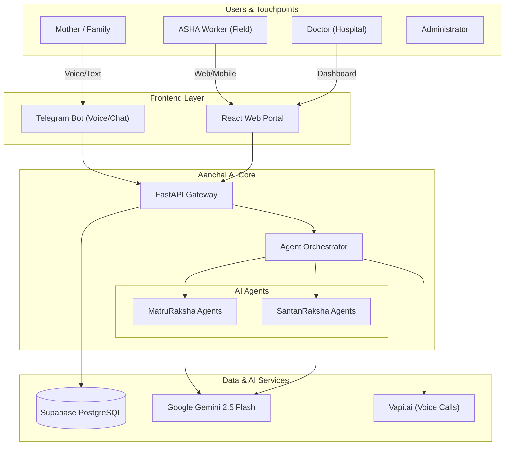

# 🏥 Aanchal AI

> **"Protecting Mothers, Nurturing Future"**

**Aanchal AI** is a comprehensive digital health ecosystem designed to combat maternal and infant mortality by bridging the gap between rural healthcare workers (ASHAs), doctors, and families. It powers two specialized AI-driven products in one unified platform:

1.  **MatruRaksha AI** 🤰 - Dedicated to **Maternal Health** (Pregnancy to Postpartum).
2.  **SantanRaksha AI** 👶 - Dedicated to **Child Health** (Neonatal to Infant care).

By leveraging Artificial Intelligence (Google Gemini 2.5 Flash), real-time data analytics, and a multi-channel approach (Web + Telegram + Voice), Aanchal AI ensures no mother or child is left behind.


---

## 🌟 Key Features

### 🔐 Secure & Flexible Access
*   **Role-Based Access Control**: specialized dashboards for **Doctors**, **ASHA Workers**, and **Admin**.
*   **Google OAuth Integration**: Seamless one-tap sign-up/login.
*   **Profile Completion Flow**: Intelligent flow for new social logins to capture critical medical/role details.
*   **Admin Approval Strategy**: Strict verification process for healthcare professionals (Id & Certificate checks).

### 🤖 Intelligent AI Agents (Powered by Gemini)
The system employs a swarm of specialized agents orchestrated to handle specific domains:
*   **Care Agent**: General pregnancy advice and wellness.
*   **Emergency Agent**: Detects urgent symptoms (bleeding, pain) and triggers alerts.
*   **Nutrition Agent**: Personalized diet plans and anaemia management.
*   **Risk Agent**: Assesses complications like Preeclampsia or Gestational Diabetes.
*   **Pediatric Agent**: Consults on child illnesses (IMNCI protocols), fever, and development.
*   **Vaccination Agent**: Tracks schedules and answers immunization queries.
*   **Growth Agent**: Monitors WHO growth standards (Z-scores) and feeding advice.

### 📱 Telegram Bot & Voice Assistance
*   **Conversational AI**: Mothers can chat naturally in their local language (Hindi, Marathi, English).
*   **Voice-First Interface**:
    *   **Speech-to-Text**: Users can send voice notes which are transcribed by Gemini.
    *   **Text-to-Speech**: AI Doctors reply with audio messages (and captions) for accessibility.
*   **Document Analysis**: Upload medical reports (PDF/Images) directly in chat for instant AI summarization and risk flagging.
*   **Multi-Profile Management**: ASHAs can manage multiple mothers from a single Telegram account.

### 📊 Comprehensive Dashboards
*   **Admin Panel**:
    *   **Mothers Tab**: Track delivery status, risk levels, and due dates.
    *   **Children Tab**: Manage pediatric records, growth charts, and vaccinations.
    *   **User Management**: Approve/Reject doctor and ASHA registrations.
    *   **Analytics**: Overview stats on total registered patients and high-risk cases.
*   **Assessment Tools**:
    *   **Postnatal & Growth**: Digital tools to record and visualize baby's weight/height over time.
    *   **Risk Evaluation**: Automated colouring of high-risk metrics.

---

## 🏗️ System Architecture

Aanchal AI acts as the central brain, orchestrating data flow between users and intelligent services.



---

## 🛠️ Technology Stack

| Component | Technology | Description |
|-----------|------------|-------------|
| **AI Core** | **Google Gemini 2.5 Flash** | Multimodal LLM for reasoning, voice, and vision |
| **Backend** | Python 3.12, FastAPI | High-performance async API with Pydantic validation |
| **Frontend** | React 18, Vite, Tailwind | Responsive dashboard with Recharts for data viz |
| **Database** | Supabase (PostgreSQL) | Managed DB with Auth, Storage, and Vector capabilities |
| **Messaging** | Telegram Bot API | Accessible interface for rural adoption |
| **Voice** | gTTS / Vapi.ai | Voice synthesis and telephony integration |

---

## ⚡ Quick Start Guide

### 1. Requirements
-   Python 3.12+
-   Node.js 18+
-   Supabase Account
-   Google Gemini API Key

### 2. Environment Setup
Create `.env` files in `backend/` and `frontend/` directories.
**Backend (.env):**
```env
SUPABASE_URL=your_url
SUPABASE_KEY=your_key
GEMINI_API_KEY=your_gemini_key
TELEGRAM_BOT_TOKEN=your_bot_token
```

### 3. Run Locally

**Backend:**
```bash
cd backend
python -m venv venv
source venv/bin/activate  # or venv\Scripts\activate on Windows
pip install -r requirements.txt
python main.py
```

**Frontend:**
```bash
cd frontend
npm install
npm run dev
```

### 4. Running Tests
```bash
pytest backend/tests/
```

---

## 🤝 Contact & License

**Antigravity Team**
*Google Deepmind Agentic Coding*
License: MIT
