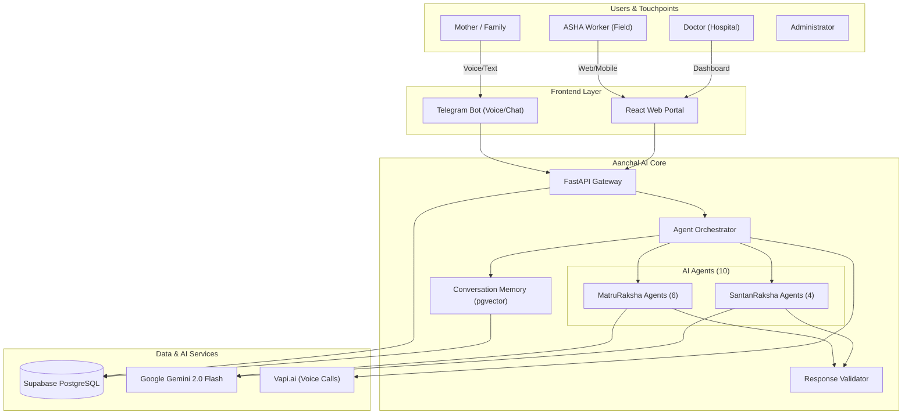

# 🏥 Aanchal AI

> **"Protecting Mothers, Nurturing Futures"**

**Aanchal AI** is a comprehensive digital health ecosystem designed to combat maternal and infant mortality by bridging the gap between rural healthcare workers (ASHAs), doctors, and families. It powers two specialized AI-driven modules in one unified platform:

1. **MatruRaksha** 🤰 — **Maternal Health** (Pregnancy to Postpartum)
2. **SantanRaksha** 👶 — **Child Health** (Neonatal to Infant care, 0–5 years)

By leveraging Artificial Intelligence (Google Gemini 2.0 Flash), real-time data analytics, and a multi-channel approach (Web + Telegram + Voice), Aanchal AI ensures no mother or child is left behind.


---

## 🌟 Key Features

### 🔐 Secure & Flexible Access

* **Role-Based Access Control**: Specialized dashboards for **Doctors**, **ASHA Workers**, and **Admin**.
* **Google OAuth Integration**: Seamless one-tap sign-up/login.
* **Profile Completion Flow**: Intelligent flow for new social logins to capture critical medical/role details.
* **Admin Approval Strategy**: Strict verification process for healthcare professionals (ID & Certificate checks).
* **Sanitized Error Responses**: All API errors are sanitized to prevent internal detail leakage.

### 🤖 Intelligent AI Agent Swarm (Powered by Gemini)

The system employs **10 specialized agents** orchestrated to handle specific health domains:

| Agent | Domain | Key Capabilities |
|-------|--------|------------------|
| **Care Agent** | Pregnancy wellness | Trimester-specific advice, symptom guidance |
| **Emergency Agent** | Urgent situations | Severity-weighted detection, multilingual emergency keywords |
| **Nutrition Agent** | Maternal diet | Personalized plans, anaemia management |
| **Risk Agent** | Complications | Preeclampsia, GDM, high-risk assessment |
| **Medication Agent** | Drug safety | Pregnancy-safe medications, dosage info |
| **ASHA Agent** | Community health | Appointments, local resources, referrals |
| **Postnatal Agent** | Post-delivery care | Lochia tracking, breastfeeding, PPD screening (EPDS) |
| **Pediatric Agent** | Child illness | IMNCI protocols, fever/diarrhea/pneumonia management |
| **Vaccine Agent** | Immunization | IAP 2023 schedule tracking, side effects |
| **Growth Agent** | Child growth | WHO z-scores, feeding guidance, malnutrition detection |

**Orchestrator Intelligence:**

* 🎯 **3-tier classification**: Keyword scoring → AI fallback → system routing (based on delivery status)
* 🧠 **Conversation Memory**: Semantic search via Supabase pgvector for follow-up context
* ✅ **Response Validation**: Clinical safety checks (IMNCI compliance, citation enforcement)
* 💰 **Cost Optimization**: LRU classification cache (5-min TTL), `gemini-2.0-flash` for routing, optimized prompts

### 📱 Telegram Bot & Voice Assistance

* **Conversational AI**: Mothers can chat naturally in their local language (Hindi, Marathi, English).
* **Voice-First Interface**:
  * **Speech-to-Text**: Users can send voice notes which are transcribed by Gemini.
  * **Text-to-Speech**: AI replies with audio messages (with language detection) for accessibility.
* **Document Analysis**: Upload medical reports (PDF/Images) directly in chat for instant AI summarization and risk flagging.
* **Multi-Profile Management**: ASHAs can manage multiple mothers from a single Telegram account.
* **Postnatal Context**: Bot automatically includes child data (vaccinations, growth, assessments) for delivered mothers.

### 📊 Comprehensive Dashboards

* **Admin Panel**:
  * **Mothers Tab**: Track delivery status, risk levels, and due dates.
  * **Children Tab**: Manage pediatric records, growth charts, and vaccinations.
  * **User Management**: Approve/Reject doctor and ASHA registrations.
  * **Analytics**: Overview stats on total registered patients and high-risk cases.
* **ASHA Dashboard**:
  * **Vaccination Calendar**: IAP 2023 schedule with Mark Done tracking per child.
  * **Postnatal Assessments**: Record mother & child health check-ins.
  * **Growth Monitoring**: Record weight/height/HC with WHO z-score calculations.

---

## 🏗️ System Architecture

Aanchal AI acts as the central brain, orchestrating data flow between users and intelligent services.



---

## 🛠️ Technology Stack

| Component | Technology | Description |
|-----------|------------|-------------|
| **AI Core** | **Google Gemini 2.0 Flash** | Multimodal LLM for reasoning, voice, and vision |
| **Backend** | Python 3.12, FastAPI | High-performance async API with Pydantic validation |
| **Frontend** | React 18, Vite | Responsive dashboards with Recharts for data viz |
| **Database** | Supabase (PostgreSQL + pgvector) | Managed DB with Auth, Storage, and Vector capabilities |
| **Messaging** | Telegram Bot API | Accessible interface for rural adoption |
| **Voice** | gTTS / Vapi.ai | Voice synthesis and telephony integration |
| **Caching** | Redis (optional) + In-memory LRU | API response caching and classification cache |

---

## ⚡ Quick Start Guide

### 1. Requirements

- Python 3.12+
* Node.js 18+
* Supabase Account
* Google Gemini API Key

### 2. Environment Setup

Create `.env` files in `backend/` and `frontend/` directories.
**Backend (.env):**

```env
SUPABASE_URL=your_url
SUPABASE_KEY=your_key
GEMINI_API_KEY=your_gemini_key
TELEGRAM_BOT_TOKEN=your_bot_token
PASSWORD_ENCRYPTION_KEY=your_encryption_key
```

### 3. Database Setup

Run the SQL migration files in `infra/supabase/` in the following order using Supabase SQL Editor:

1. `infra/supabase/migration_santanraksha_v1.sql` (Core tables for Child Health)
2. `infra/supabase/migration_voice_features_v2.sql` (Voice & Consultation features)

### 4. Run Locally

**Backend:**

```bash
cd backend
python -m venv venv
source venv/bin/activate  # or venv\Scripts\activate on Windows
pip install -r requirements.txt
python main.py
```

**Frontend:**

```bash
cd frontend
npm install
npm run dev
```

**Scheduler (Optional):**
To run the background scheduler for reminders:

```bash
cd backend
python scheduler.py
```

### 5. Running Tests

**Unit Tests:**

```bash
pytest backend/tests/
```

**Integration/Script Tests:**

```bash
pytest backend/scripts/test_*.py
```

### 6. Utility Scripts

Useful maintenance scripts are located in `backend/scripts/`:
* `check_users.py`: Verify user roles.
* `fix_approved_users.py`: Fix approval status issues.
* `verify_setup.py`: Check system configuration.

---

## 📚 Documentation

- [API Specification](docs/API_SPECIFICATION.md)
* [SantanRaksha (Child Health) Details](docs/SANTANRAKSHA.md)
* [Architecture](docs/architecture.md)

---

## 🤝 License

License: MIT
