# 🤰 MatruRakshaAI

> AI-Powered Maternal Health Monitoring & Care System for Underserved Communities

[](https://www.python.org/)
[](https://fastapi.tiangolo.com/)
[](https://reactjs.org/)
[](LICENSE)

MatruRakshaAI is an intelligent maternal health monitoring system that leverages AI agents, Telegram integration, and continuous care protocols to provide 24/7 support for pregnant mothers in low-resource settings.

---

## 📋 Table of Contents

- [What's New](#-whats-new)
- [Features](#-features)
- [Architecture](#-architecture)
- [Tech Stack](#-tech-stack)
- [Installation](#-installation)
- [Usage](#-usage)
- [API Documentation](#-api-documentation)
- [AI Agents](#-ai-agents)
- [Deployment](#-deployment)
- [Contributing](#-contributing)
- [License](#-license)

---

## 🆕 What's New

### v2.3.0 - Performance Optimizations (December 2024)
- ✅ **In-Memory Caching** - 30-second TTL cache for dashboard data (no Redis needed)
- ✅ **Optimized Database Queries** - COUNT queries instead of SELECT * for aggregates
- ✅ **Combined API Endpoints** - `/dashboard/full` and `/admin/full` reduce API calls by 75%
- ✅ **Fixed N+1 Query Patterns** - Admin routes now batch queries efficiently
- ✅ **Frontend Parallel Fetching** - Promise.all with combined endpoint fallback
- ✅ **3x Faster Dashboard Loading** - First load and instant repeat loads within cache TTL

### v2.2.0 - Enhanced Authentication (December 2024)
- ✅ **Google OAuth Integration** - Users can now sign in with Google
- ✅ **Role Selection Flow** - New users select their role (Doctor/ASHA Worker) after OAuth
- ✅ **Doctor Certificate Upload** - Doctors upload medical registration certificates for verification
- ✅ **Multi-Step Onboarding** - Guided registration process with pending approval screen
- ✅ **Unified Approval Center** - `/admin/approvals` handles all pending registrations
- ✅ **Email Alerts** - Send emergency alerts to assigned doctors/ASHA workers via Resend API

See [CHANGELOG.md](CHANGELOG.md) for full version history.

---


## ✨ Features

### 🤖 **AI-Powered Health Monitoring**
- **6 Specialized AI Agents** working in orchestration (powered by Gemini 2.5 Flash)
- Real-time risk assessment and emergency detection
- Personalized care plans and nutrition guidance
- Medication management and reminders
- ASHA worker coordination

### 📱 **Telegram Bot Integration**
- 24/7 conversational health support
- Daily health check-ins and reminders
- Interactive symptom reporting
- Natural language query processing
- Emergency protocol activation

### 🔐 **Enhanced Authentication & User Management** *(NEW)*
- **Google OAuth Integration** - Sign in with Google for easy onboarding
- **Role-Based Access Control** - ADMIN, DOCTOR, ASHA_WORKER roles
- **Multi-Step Registration Flow** - Role selection after OAuth signup
- **Document Upload for Doctors** - Medical registration certificate verification
- **Pending Approval System** - Admin reviews and approves new users

### 👨‍💼 **Admin Dashboard & Approvals** *(NEW)*
- **Unified Approval Center** - Handle all pending registrations in one place
- **Role Request Management** - Approve/Reject role requests with document verification
- **User Management** - Manage doctors, ASHA workers, and mothers
- **Assignment Tools** - Assign mothers to doctors and ASHA workers
- **Email Alerts** - Send emergency alerts to assigned healthcare workers

### 📧 **Email Notification System** *(NEW)*
- **Resend API Integration** - Reliable email delivery
- **Emergency Alerts** - Beautiful HTML email templates for urgent situations
- **Risk Notifications** - Notify doctors about high-risk patients
- **Customizable Templates** - Professional MatruRaksha-branded emails

### 🌐 Multilingual Chatbot (Upcoming / In progress)
- Natural-language conversational support in multiple Indian languages (Hindi, Tamil, Telugu, Bengali, Marathi, and more)
- Automatic language detection and user-preferred language persistence
- Voice & text modes: receive voice messages, transcribe, and respond in the user's language
- Localized prompts and culturally-aware responses for better engagement and comprehension

### 📊 **Continuous Care System**
- Daily health monitoring (40-week journey)
- Weekly automated assessments
- Milestone tracking (12, 20, 28, 36 weeks)
- Health timeline and trend analysis
- Risk progression tracking

### 👩‍⚕️ **Healthcare Worker Tools**
- ASHA visit scheduling and reporting
- Emergency alert system
- Risk-based visit frequency
- Comprehensive patient dashboard
- Analytics and reporting
- **Doctor Certificate Viewing** - Admin can view uploaded certificates

---

## 🏗️ Architecture

### System Overview

```mermaid
flowchart TB
    subgraph USERS[" 👥 USERS "]
        direction LR
        Mother["🤰 Pregnant Mother"]
        ASHA["👩‍⚕️ ASHA Worker"]
        Doctor["👨‍⚕️ Doctor"]
        Admin["👨‍💼 Admin"]
    end

    subgraph FRONTEND[" 🌐 FRONTEND "]
        WebApp["Web Dashboard:5173"]
        RiskDash["Risk Dashboard"]
        DoctorDash["Doctor Dashboard"]
        ASHAPanel["ASHA Interface"]
        AdminDash["Admin Dashboard"]
    end

    subgraph BACKEND[" ⚙️ BACKEND "]
        API["REST API\n:8000"]
        AuthSvc["Auth Service"]
        CacheSvc[("Cache\n30s TTL")]
        AgentsSvc["AI Agents"]
        Scheduler["Scheduler"]
    end

    subgraph EXTERNAL[" 🔗 EXTERNAL "]
        TG["Telegram Bot"]
        Gemini["Gemini AI"]
        Email["Resend Email"]
    end

    subgraph DATABASE[" 🗄️ DATABASE "]
        PG[("PostgreSQL")]
        SupaAuth["Supabase Auth"]
        Storage[("File Storage")]
    end

    Mother -.-> TG
    Mother --> WebApp
    ASHA --> ASHAPanel
    Doctor --> DoctorDash
    Admin --> AdminDash

    WebApp --> API
    TG --> API
    API <--> CacheSvc
    CacheSvc <--> PG
    API --> AuthSvc
    AuthSvc <--> SupaAuth
    API --> AgentsSvc
    AgentsSvc --> Gemini
    API --> Email
    Scheduler --> API

    style USERS fill:#c8e6c9,stroke:#2e7d32,stroke-width:3px,color:#1b5e20
    style FRONTEND fill:#bbdefb,stroke:#1565c0,stroke-width:3px,color:#0d47a1
    style BACKEND fill:#ffe0b2,stroke:#ef6c00,stroke-width:3px,color:#e65100
    style EXTERNAL fill:#e1bee7,stroke:#7b1fa2,stroke-width:3px,color:#4a148c
    style DATABASE fill:#ffcdd2,stroke:#c62828,stroke-width:3px,color:#b71c1c
```




### Frontend Architecture


### Backend Architecture


### Database Schema


### User Authentication Flow


### Data Flow - Risk Assessment


### Performance Optimization Flow


### AI Agent Orchestration

```mermaid
flowchart TB
    Input(["📥 User Query"])
    
    subgraph ORCH[" 🎯 ORCHESTRATOR "]
        Classify{{"Gemini AI\nIntent Classification"}}
    end
    
    subgraph AGENTS[" 🤖 AI AGENTS "]
        Risk["⚠️ RISK\nBP Analysis\nScoring"]
        Care["💊 CARE\nDaily Tasks\nExercise"]
        Nutrition["🥗 NUTRITION\nMeal Plans\nSupplements"]
        Medication["💉 MEDICATION\nReminders\nCompliance"]
        Emergency["🚨 EMERGENCY\nAlerts\nProtocol"]
        ASHA["👩‍⚕️ ASHA\nVisits\nCoordination"]
    end
    
    Output(["📤 Response"])
    
    Input --> Classify
    Classify -->|"Health"| Risk
    Classify -->|"Care"| Care
    Classify -->|"Food"| Nutrition
    Classify -->|"Medicine"| Medication
    Classify -->|"Urgent"| Emergency
    Classify -->|"Visit"| ASHA
    
    Risk --> Output
    Care --> Output
    Nutrition --> Output
    Medication --> Output
    Emergency --> Output
    ASHA --> Output

    style ORCH fill:#ffe0b2,stroke:#ef6c00,stroke-width:3px,color:#e65100
    style AGENTS fill:#c8e6c9,stroke:#2e7d32,stroke-width:3px,color:#1b5e20
    style Input fill:#bbdefb,stroke:#1565c0,stroke-width:3px,color:#0d47a1
    style Output fill:#bbdefb,stroke:#1565c0,stroke-width:3px,color:#0d47a1
```




---

## 🛠️ Tech Stack

### **Backend**
- **Framework:** FastAPI (Python 3.11+)
- **Database:** Supabase (PostgreSQL)
- **AI/ML:** NumPy, scikit-learn
- **Task Scheduler:** Python Schedule
- **API:** REST with async support

### **Frontend**
- **Framework:** React 18
- **Build Tool:** Vite
- **Styling:** Tailwind CSS
- **Charts:** Recharts
- **Icons:** Lucide React

### **Integration**
- **Messaging:** Telegram Bot API
- **Real-time:** WebSocket support
- **Authentication:** Supabase Auth
- **Storage:** Supabase Storage

### **AI Agents**
- Risk Assessment Agent
- Care Planning Agent
- Nutrition Agent
- Medication Agent
- Emergency Detection Agent
- ASHA Coordination Agent

---

## 🚀 Installation

### **Prerequisites**
- Python 3.11 or higher
- Node.js 20.19+ (Vite requires Node 20.19+ or 22.12+; using Node 20+ is recommended)
- Supabase account
- Telegram Bot Token

### **1. Clone Repository**
```bash
git clone https://github.com/yourusername/maatru-raksha-ai.git
cd maatru-raksha-ai
```

### **2. Backend Setup**

```bash
cd backend

# Create virtual environment
python -m venv venv

# Activate virtual environment
# Windows:
venv\Scripts\activate
# Linux/Mac:
source venv/bin/activate

# Install dependencies
pip install -r requirements.txt

# Create .env file
cp .env.example .env
# Edit .env with your credentials
```

**Backend `.env` configuration:**
```env
# Supabase Configuration
SUPABASE_URL=your_supabase_project_url
SUPABASE_KEY=your_supabase_anon_key
SUPABASE_SERVICE_ROLE_KEY=your_supabase_service_role_key

# Telegram Bot
TELEGRAM_BOT_TOKEN=your_telegram_bot_token
BACKEND_API_BASE_URL=http://localhost:8000

# Frontend URL (for CORS)
FRONTEND_URL=http://localhost:5173

# Gemini AI
GEMINI_API_KEY=your_gemini_api_key
GEMINI_MODEL_NAME=gemini-2.5-flash

# Email Notifications (Resend)
RESEND_API_KEY=your_resend_api_key
FROM_EMAIL=onboarding@resend.dev
FROM_NAME=MatruRaksha AI
```

### **3. Database Setup**

Run migrations in Supabase SQL Editor:
```sql
-- See /infra/supabase/schema.sql for complete schema
```

### **4. Frontend Setup**

```bash
cd frontend

# Ensure you are running Node 20.19+ (or Node 22+). If you see errors like
# "crypto.hash is not a function" or a Vite Node version warning, upgrade Node.

# Install dependencies
npm install

# Create .env.local file (or edit existing `.env`)
cp .env.example .env.local
# Edit with your configuration
```

**Frontend `.env.local` configuration:**
```env
VITE_SUPABASE_URL=your_supabase_project_url
VITE_SUPABASE_ANON_KEY=your_supabase_anon_key
# Base URL for backend API used by the frontend (example: https://your-backend.example)
VITE_API_URL=http://localhost:8000
VITE_TELEGRAM_BOT_NAME=YourTelegramBotName
```

Note: This project uses Vite (dev server on port 5173). If you run into the Vite Node version warning or the
error "TypeError: crypto.hash is not a function", upgrade Node to v20.19+ (or v22.12+).

### **5. Get Telegram Bot Token**

1. Open Telegram and search for `@BotFather`
2. Send `/newbot` and follow instructions
3. Copy the bot token
4. Add to `backend/.env`

---

## 💻 Usage

### **Start Backend Server**

```bash
cd backend
python main.py
```

Server runs at: `http://localhost:8000`
- API Docs: `http://localhost:8000/docs`
- Health Check: `http://localhost:8000/health`
- Auth routes: `/auth/...`

### **Start Frontend**

```bash
cd frontend
npm run dev
```

Dashboard runs at: `http://localhost:5173` (Vite dev server)
Ensure `FRONTEND_URL` in backend `.env` matches this origin.

### **Start Scheduler (For Automated Tasks)**

```bash
cd backend
python scheduler.py

# Or test mode (immediate execution):
python scheduler.py test
```

### **Configure Telegram Bot**

1. Get your Chat ID:
   - Message your bot: `/start`
   - Copy the chat ID displayed

2. Register a mother with Telegram:
   ```bash
   curl -X POST http://localhost:8000/mothers/register \
     -H "Content-Type: application/json" \
     -d '{
       "name": "Test Mother",
       "phone": "9876543210",
       "age": 28,
       "gravida": 2,
       "parity": 1,
       "bmi": 22.5,
       "location": "Mumbai",
       "preferred_language": "en",
       "telegram_chat_id": "YOUR_CHAT_ID"
     }'
   ```

---

## 📡 API Documentation

### Active API endpoints (implemented in `backend/main.py`)

The backend FastAPI app currently exposes the following endpoints by default (these are the routes actually registered in `backend/main.py`):

**Core Endpoints:**
- GET /                — Root endpoint (basic info, links to /docs)
- GET /health          — Health check for the backend and services

**Mother Management:**
- POST /mothers/register      — Register a new mother (JSON body, see the `Mother` model)
- GET  /mothers               — List all registered mothers
- GET  /mothers/{mother_id}   — Get a specific mother by ID

**Report Analysis:**
- POST /analyze-report        — Analyze a medical report using Gemini AI
- GET  /reports/{mother_id}   — Get all medical reports for a mother
- GET  /reports/telegram/{telegram_chat_id} — Get reports by Telegram chat id

**Risk Assessment:**
- POST /risk/assess           — Submit a risk assessment (JSON body)
- GET  /risk/mother/{mother_id} — Get risk assessments for a mother

**Analytics:**
- GET  /analytics/dashboard   — Basic dashboard analytics (counts and risk distribution)

**Authentication Endpoints (NEW):**
- POST /auth/signin           — Sign in with email/password
- POST /auth/signup           — Register new user with role
- POST /auth/signout          — Sign out current user
- GET  /auth/profile          — Get current user profile
- PUT  /auth/profile          — Update user profile
- POST /auth/upload-cert      — Upload doctor certification document

**Registration Request Management (Admin):**
- GET  /auth/register-requests                    — List pending form registrations
- POST /auth/register-requests/{id}/decision      — Approve/Reject a form request
- GET  /auth/pending-users                        — List OAuth users with no role
- POST /auth/pending-users/{id}/assign-role       — Assign role to pending user
- POST /auth/pending-users/{id}/reject            — Reject pending user

**Role Request Management (Admin - NEW):**
- GET  /auth/role-requests                        — List role requests from OAuth flow
- POST /auth/role-requests/{id}/approve           — Approve role request
- POST /auth/role-requests/{id}/reject            — Reject role request

**Admin Dashboard Endpoints (NEW):**
- GET  /admin/stats                   — Get dashboard statistics
- GET  /admin/doctors                 — List all doctors
- GET  /admin/doctors/{id}            — Get doctor details
- PUT  /admin/doctors/{id}            — Update doctor
- DELETE /admin/doctors/{id}          — Delete doctor
- GET  /admin/asha-workers            — List all ASHA workers
- GET  /admin/asha-workers/{id}       — Get ASHA worker details
- PUT  /admin/asha-workers/{id}       — Update ASHA worker
- DELETE /admin/asha-workers/{id}     — Delete ASHA worker
- GET  /admin/mothers                 — List all mothers with assignments
- POST /admin/mothers/{id}/assign-asha    — Assign mother to ASHA worker
- POST /admin/mothers/{id}/assign-doctor  — Assign mother to doctor
- POST /admin/mothers/{id}/send-alert     — Send email alert to assigned workers

Interactive docs are available at `http://localhost:8000/docs` when the backend is running.

**Notes on optional/extra endpoints:**

`backend/enhanced_api.py` contains an `APIRouter` with enhanced routes (prefixed with `/api/v1`, e.g. `/api/v1/reports/analyze`, `/api/v1/memory/store`, `/api/v1/agent/query`, etc.). These endpoints are mounted when available and are accessible at `/api/v1/...`.

---

## 🤖 AI Agents

### **1. Risk Assessment Agent**
- Analyzes 6 risk factors (age, BMI, BP, hemoglobin, history, pregnancy status)
- Multi-factor risk scoring algorithm
- Personalized recommendations
- Next checkup scheduling

### **2. Emergency Detection Agent**
- Real-time emergency protocol activation
- 5+ emergency condition monitoring
- Immediate action instructions
- ASHA worker alerting

### **3. Care Planning Agent**
- Daily task generation
- Exercise plans (risk-adjusted)
- Checkup scheduling
- Warning sign monitoring

### **4. Nutrition Agent**
- Trimester-specific meal plans
- Anemia-aware nutrition
- Supplement recommendations
- Foods to avoid

### **5. Medication Agent**
- Smart medication scheduling
- Drug interaction awareness
- Reminder system
- Compliance tracking

### **6. ASHA Coordination Agent**
- Risk-based visit scheduling
- Emergency alerts
- Visit checklists
- Follow-up coordination

---

## 🎯 Key Features in Detail

### **Continuous Monitoring (40 Weeks)**

```
Week 1-40: Daily
├─ 8:00 AM: Daily reminder
├─ Mother check-in
├─ AI analysis
├─ Alerts if needed
└─ Weekly assessment

Milestones:
├─ Week 12: First trimester screening
├─ Week 20: Anatomy scan
├─ Week 28: Glucose test
├─ Week 36: Birth plan
└─ Week 40: Delivery prep
```

### **Telegram Bot Commands**

```
/start    - Get chat ID & welcome message
/checkin  - Daily health check-in
/status   - Current health status
/timeline - View health history
/report   - Report symptoms
/help     - Show all commands
/cancel   - Cancel in-progress registration and return to Home
```

### Telegram Dashboard

The bot presents a simple Home dashboard with four buttons arranged vertically:

- Health Reports — View uploaded reports and AI analyses.
- Switch Profiles — Switch between linked mother profiles.
- Upload Documents — Send new medical documents for analysis.
- Register Another Mother — Start registration for an additional profile.

Notes:
- The Refresh button has been removed; messages update automatically.
- If a registration is active, other actions may be temporarily paused. Completing or cancelling registration immediately restores normal access.

**Natural Language Queries:**
- "What should I eat to increase hemoglobin?"
- "I have a severe headache"
- "When should I take my iron tablets?"

**Agent Routing:**
- Free-form Telegram messages are classified and routed to specialized agents.
- Nutrition → Nutrition Agent; Medication → Medication Agent; Appointments → ASHA Agent; Emergencies → Emergency Agent.
- If `GEMINI_API_KEY` is set, Gemini provides intent classification and safe fallback responses using `GEMINI_MODEL_NAME` (default `gemini-2.5-flash`).

---

## 📊 Analytics Dashboard

- Total mothers registered
- Risk level distribution (High/Medium/Low)
- Total assessments performed
- Agent performance metrics
- Emergency response times
- ASHA visit statistics

---

## 🔧 Configuration

### **Scheduler Configuration**

Edit times in `backend/scheduler.py`:

```python
# Daily reminders at 8 AM
schedule.every().day.at("08:00").do(send_daily_reminders)

# Medication reminders
schedule.every().day.at("09:00").do(send_medication_reminders_morning)
schedule.every().day.at("18:00").do(send_medication_reminders_evening)

# Weekly assessment every Monday at 9 AM
schedule.every().monday.at("09:00").do(run_weekly_assessments)
```

### **Agent Configuration**

Agents can be configured in individual files:
- `backend/agents/risk_agent.py` - Risk thresholds
- `backend/agents/emergency_agent.py` - Emergency protocols
- `backend/agents/nutrition_agent.py` - Meal plans
- etc.

### **Admin Approvals** *(Enhanced)*

The admin approval system handles three types of pending users:

**1. Role Selection Requests (Google OAuth Flow):**
- Users sign in with Google → Select role (Doctor/ASHA Worker)
- Doctors upload medical registration certificate
- Request goes to `registration_requests` table with status `PENDING`
- Admin views certificate and approves → User gets role assigned

**2. Legacy Pending Users:**
- OAuth users who signed in before role selection was implemented
- No role in `user_profiles` table
- Admin assigns role directly

**3. Form Registration Requests:**
- Users who registered via the form (email/password)
- Admin approves and creates their account

**Frontend Pages:**
- `/admin/approvals` - Unified approval center (ADMIN only)
- `/admin/dashboard` - Manage doctors, ASHA workers, mothers

**Backend Endpoints:**
```
GET  /auth/role-requests              — List role requests (OAuth flow)
POST /auth/role-requests/{id}/approve — Approve with role assignment
POST /auth/role-requests/{id}/reject  — Reject request

GET  /auth/pending-users              — List legacy pending users
POST /auth/pending-users/{id}/assign-role — Assign role
POST /auth/pending-users/{id}/reject  — Reject user

GET  /auth/register-requests          — List form registrations
POST /auth/register-requests/{id}/decision — Approve/Reject
```

**Database Tables:**
- `registration_requests` - Stores role requests with doctor certificates
- `user_profiles` - Stores user roles and profile info
- `doctors` - Doctor-specific information (with `degree_cert_url`)
- `asha_workers` - ASHA worker-specific information

**User Flow:**
```
1. User signs in with Google
         ↓
2. AuthCallback shows role selection
         ↓
3. Doctor? → Upload certificate
         ↓
4. Request saved to registration_requests (status: PENDING)
         ↓
5. Admin sees request in /admin/approvals
         ↓
6. Admin views certificate → Clicks Approve
         ↓
7. Backend creates user_profiles + doctors/asha_workers entry
         ↓
8. User can now access their dashboard
```

---

## 🐳 Deployment

### **Docker Deployment**

This project includes Dockerfiles for the backend and frontend. Example commands below show how to build and run
the services locally without docker-compose.

Backend (build & run):

```powershell
cd backend
docker build -t matruraksha-backend:latest .
# Run and map port 8000, pass env file
docker run --rm -p 8000:8000 --env-file .env matruraksha-backend:latest
```

Frontend (development - Vite) (build & run):

```powershell
cd frontend
docker build -t matruraksha-frontend:dev .
# Run the dev container and map Vite's port 5173
docker run --rm -p 5173:5173 matruraksha-frontend:dev
```

If you prefer a production frontend build, build with `npm run build` and serve via a static server (e.g., nginx) or
use the multi-stage production Dockerfile pattern.

### **Production Considerations**

1. **Environment Variables**: Use production keys
2. **Database**: Use managed PostgreSQL
3. **Scheduler**: Run as systemd service or cron
4. **SSL/TLS**: Use HTTPS for production
5. **Monitoring**: Setup logging and alerts
6. **Backups**: Regular database backups

---

## 🧪 Testing

```bash
# Backend tests
cd backend
pytest

# Frontend tests
cd frontend
npm test

# API tests
curl http://localhost:8000/health

# Agent tests
curl http://localhost:8000/agents/status

# Scheduler test
python scheduler.py test
```

---

## 🤝 Contributing

Contributions are welcome! Please follow these steps:

1. Fork the repository
2. Create a feature branch (`git checkout -b feature/AmazingFeature`)
3. Commit your changes (`git commit -m 'Add some AmazingFeature'`)
4. Push to the branch (`git push origin feature/AmazingFeature`)
5. Open a Pull Request

### **Development Guidelines**
- Follow PEP 8 for Python code
- Use ESLint for JavaScript/React
- Write meaningful commit messages
- Add tests for new features
- Update documentation

---

## 📄 License

This project is licensed under the MIT License - see the [LICENSE](LICENSE) file for details.

---

## 👥 Team

**MatruRakshaAI** - Developed for improving maternal healthcare in underserved communities.

---

## 📞 Support

For issues, questions, or contributions:
- **GitHub Issues**: [Create an issue](https://github.com/yourusername/maatru-raksha-ai/issues)
- **Email**: support@matruraksha.ai
- **Telegram**: [@MatruRakshaSupport](https://t.me/MatruRakshaSupport)

---

## 🙏 Acknowledgments

- **Anthropic Claude** - AI assistance and agent orchestration
- **Supabase** - Database and authentication
- **Telegram** - Messaging platform
- **FastAPI** - Modern Python web framework
- **React** - Frontend library
- **ASHA Workers** - Community health workers inspiration

---

## 📈 Roadmap

- [ ] Voice-based interaction (multilingual)
- [ ] WhatsApp integration
- [ ] IoT device integration (BP monitors, weight scales)
- [ ] Predictive analytics for complications
- [ ] Mobile app (iOS/Android)
- [ ] Multi-language support (Hindi, Tamil, Telugu, Bengali)
- [ ] Doctor portal
- [ ] SMS fallback for no internet
- [ ] Offline mode support

### Upcoming features (priority & notes)

- High priority
  - Multilingual chatbot (text + voice): support for Hindi, Tamil, Telugu, Bengali, Marathi and auto-detection. This will integrate speech-to-text, translation layers where necessary, and localized response templates to ensure clinical accuracy and cultural relevance.
  - Offline & SMS fallback: critical for low-connectivity areas to ensure reminders and alerts still reach mothers and ASHA workers.

- Medium priority
  - WhatsApp integration: reach users on a widely used messaging platform with end-to-end message templates and OTP flows.
  - Mobile app (iOS/Android): a lightweight app for ASHA workers with offline sync and push notifications.

- Lower priority
  - IoT integration (BP monitors, scales): collect objective vitals when available; begin with Bluetooth-enabled devices and a standardized ingestion pipeline.
  - Doctor portal and advanced analytics: role-based dashboards for clinicians and predictive models for early warning.

Notes:
- The "Multilingual chatbot" feature will require data collection for localization, evaluation with healthcare professionals for safety, and careful privacy considerations for user speech and text data.


---

## 🌟 Star History

If you find this project useful, please consider giving it a ⭐ on GitHub!

---

<p align="center">
  Made with ❤️ for mothers everywhere
</p>

<p align="center">
  <sub>MatruRakshaAI - Because every mother deserves quality healthcare</sub>
</p>
