# 🤰 MatruRakshaAI - Complete Project Documentation

> AI-Powered Maternal Health Monitoring & Care System with Hybrid RAG and Offline-First Architecture

[](https://www.python.org/)
[](https://fastapi.tiangolo.com/)
[](https://reactjs.org/)
[](https://supabase.com/)
[](https://ai.google.dev/)

---

## 📋 Table of Contents

- [Project Overview](#-project-overview)
- [What's New (v3.0)](#-whats-new-v30---ai-enhancement--offline-sync)
- [Complete Architecture](#-complete-architecture)
- [User Flows](#-user-flows)
- [Feature Comparison](#-feature-comparison-existing-vs-new)
- [Tech Stack](#-tech-stack)
- [Setup Guide](#-setup-guide)
- [API Reference](#-api-reference)

---

## 🎯 Project Overview

MatruRakshaAI is an intelligent maternal health monitoring system designed for underserved communities. It combines:

- **6 Specialized AI Agents** powered by Google Gemini
- **Telegram Bot** for 24/7 accessible care
- **Web Dashboard** for healthcare workers
- **Hybrid RAG** for evidence-based recommendations (NEW)
- **Offline-First Sync** for low-connectivity areas (NEW)

### Target Users

| User | Access Point | Primary Features |
|------|-------------|------------------|
| 🤰 **Pregnant Mother** | Telegram Bot | Health queries, daily check-ins, emergency alerts |
| 👩‍⚕️ **ASHA Worker** | Web Dashboard | Patient monitoring, visit scheduling, risk tracking |
| 👨‍⚕️ **Doctor** | Web Dashboard | Case review, risk assessments, treatment plans |
| 👨‍💼 **Admin** | Web Dashboard | User management, approvals, system oversight |

---

## 🆕 What's New (v3.0) - AI Enhancement & Offline Sync

### ⚡ Hybrid RAG System (NEW)

Retrieval-Augmented Generation using 1,015 maternal health cases for context-aware AI responses.

```mermaid
flowchart TB
    Query["📥 User Query: 28yr, BP 140/90, BS 15"]
    
    subgraph FILTER["STEP 1: Metadata Filtering"]
        F1["Filter by age range 25-35"]
        F2["Filter by risk level"]
        F3["Filter by BP ranges"]
    end
    
    subgraph RETRIEVAL["STEP 2: Hybrid Retrieval"]
        BM25["🔤 BM25 Sparse Search<br/>Keywords: hypertension, diabetes"]
        PGVEC["🧮 pgvector Dense Search<br/>768-dim Gemini Embeddings"]
    end
    
    subgraph FUSION["STEP 3: Reciprocal Rank Fusion"]
        RRF["Combine BM25 + pgvector scores"]
        TOPK["Top-K similar cases"]
    end
    
    subgraph GEMINI["STEP 4: Gemini AI + Context"]
        CTX["📋 Similar Cases Context:<br/>• Case 1: 27yr, BP 145/95 → HIGH RISK<br/>• Case 2: 29yr, BP 138/88 → MID RISK<br/>• Case 3: 28yr, BP 142/92 → HIGH RISK"]
        LLM["🤖 Gemini 2.5 Flash"]
        RESP["📤 Response with evidence"]
    end
    
    Query --> FILTER
    F1 --> BM25
    F2 --> BM25
    F3 --> BM25
    F1 --> PGVEC
    F2 --> PGVEC
    F3 --> PGVEC
    BM25 --> RRF
    PGVEC --> RRF
    RRF --> TOPK
    TOPK --> CTX
    CTX --> LLM
    LLM --> RESP
    
    style Query fill:#e3f2fd
    style FILTER fill:#fff3e0
    style RETRIEVAL fill:#e8f5e9
    style FUSION fill:#f3e5f5
    style GEMINI fill:#fce4ec
```



**Key Components:**

- **Embeddings**: Gemini `text-embedding-004` (768 dimensions)
- **Vector Store**: Supabase pgvector (no external DB needed)
- **Sparse Search**: BM25 for keyword matching (local, fast)
- **Fusion**: RRF combines both for best results

### 📴 Offline-First Data Sync (NEW)

Ensures forms, chats, and documents are never lost in low-connectivity areas.

```mermaid
flowchart TB
    Action["👤 User Action<br/>Form Submit / Chat / Doc Upload"]
    
    subgraph CHECK["Network Check"]
        Online{"navigator.onLine?"}
    end
    
    subgraph ONLINE_PATH["✅ ONLINE"]
        API["🌐 API Call"]
        SB1[("Supabase")]
        Success["✓ Success"]
    end
    
    subgraph OFFLINE_PATH["📴 OFFLINE"]
        IDB[("IndexedDB")]
        PF["pendingForms"]
        PC["pendingChats"]
        PD["pendingDocs"]
        Saved["💾 Saved Locally"]
    end
    
    subgraph SYNC["🔄 Auto-Sync on Reconnect"]
        Event["'online' event"]
        Batch["POST /api/sync/batch"]
        SB2[("Supabase")]
        Clear["Clear IndexedDB"]
        Done["✓ Synced!"]
    end
    
    Action --> Online
    Online -->|Yes| API
    API --> SB1
    SB1 --> Success
    
    Online -->|No| IDB
    IDB --> PF
    IDB --> PC
    IDB --> PD
    PF --> Saved
    PC --> Saved
    PD --> Saved
    
    Saved -.-> Event
    Event --> Batch
    Batch --> SB2
    SB2 --> Clear
    Clear --> Done
    
    style Action fill:#e3f2fd
    style ONLINE_PATH fill:#c8e6c9
    style OFFLINE_PATH fill:#ffecb3
    style SYNC fill:#e1bee7
```



**Features:**

- **Auto-detect** online/offline status
- **Transparent** queuing (user doesn't notice)
- **Retry logic** with exponential backoff
- **Document support** (base64 encoded for offline)

---

## 🏗️ Complete Architecture

### High-Level System Design

```mermaid
flowchart TB
    subgraph USERS[" 👥 USERS "]
        Mother["🤰 Mother"]
        ASHA["👩‍⚕️ ASHA"]
        Doctor["👨‍⚕️ Doctor"]
        Admin["👨‍💼 Admin"]
    end

    subgraph FRONTEND[" 🌐 FRONTEND (React) "]
        WebApp["Web Dashboard :5173"]
        OfflineSync["Offline Sync Service"]
        IndexedDB[("IndexedDB")]
    end

    subgraph TELEGRAM[" 📱 TELEGRAM "]
        TGBot["MatruRaksha Bot"]
    end

    subgraph BACKEND[" ⚙️ BACKEND (FastAPI) "]
        API["REST API :8000"]
        Orchestrator["AI Orchestrator"]
        RAGService["Hybrid RAG Service"]
        SyncRoutes["Offline Sync Routes"]
    end

    subgraph AI_AGENTS[" 🤖 AI AGENTS "]
        Risk["Risk Agent"]
        Care["Care Agent"]
        Nutrition["Nutrition Agent"]
        Medication["Medication Agent"]
        Emergency["Emergency Agent"]
        ASHAAgent["ASHA Agent"]
    end

    subgraph EXTERNAL[" 🔗 EXTERNAL SERVICES "]
        Gemini["Gemini AI"]
        GeminiEmbed["Gemini Embeddings"]
        Resend["Resend Email"]
    end

    subgraph DATABASE[" 🗄️ SUPABASE "]
        PG[("PostgreSQL")]
        pgvector[("pgvector")]
        Auth["Supabase Auth"]
        Storage[("File Storage")]
    end

    Mother --> TGBot
    Mother --> WebApp
    ASHA --> WebApp
    Doctor --> WebApp
    Admin --> WebApp

    TGBot --> API
    WebApp --> OfflineSync
    OfflineSync <--> IndexedDB
    OfflineSync --> API

    API --> Orchestrator
    API --> RAGService
    API --> SyncRoutes
    
    Orchestrator --> Risk & Care & Nutrition
    Orchestrator --> Medication & Emergency & ASHAAgent
    
    RAGService --> GeminiEmbed
    RAGService --> pgvector
    
    Risk & Care --> Gemini
    
    API --> PG
    API --> Auth
    API --> Storage
    API --> Resend

    style USERS fill:#e8f5e9
    style FRONTEND fill:#e3f2fd
    style TELEGRAM fill:#fff3e0
    style BACKEND fill:#fce4ec
    style AI_AGENTS fill:#f3e5f5
    style EXTERNAL fill:#e0f2f1
    style DATABASE fill:#fff8e1
```



### Backend Module Structure

```
backend/
├── main.py                 # FastAPI entry point
├── telegram_bot.py         # Telegram bot handlers
├── scheduler.py            # Cron jobs
│
├── agents/
│   ├── orchestrator.py     # Routes to specialized agents + RAG context
│   ├── base_agent.py       # Base class (now includes RAG context in prompts)
│   ├── risk_agent.py       # Risk assessment
│   ├── care_agent.py       # Daily care plans
│   ├── nutrition_agent.py  # Diet and nutrition
│   ├── medication_agent.py # Medicine management
│   ├── emergency_agent.py  # Emergency protocols
│   └── asha_agent.py       # ASHA worker coordination
│
├── services/
│   ├── rag_service.py      # [NEW] Hybrid RAG with BM25 + pgvector
│   ├── supabase_service.py # Database operations
│   ├── cache_service.py    # In-memory TTL cache
│   ├── auth_service.py     # Authentication
│   ├── email_service.py    # Resend integration
│   └── memory_service.py   # AI context management
│
├── routes/
│   ├── auth_routes.py      # Authentication endpoints
│   ├── admin_routes.py     # Admin dashboard
│   ├── vapi_routes.py      # Voice API
│   └── offline_queue_routes.py  # [NEW] Batch sync endpoints
│
└── middleware/
    └── auth.py             # JWT verification
```

### Frontend Module Structure

```
frontend/src/
├── App.jsx
├── main.jsx
│
├── pages/
│   ├── Home.jsx
│   ├── Login.jsx
│   ├── RiskDashboard.jsx
│   ├── DoctorDashboard.jsx
│   ├── ASHAInterface.jsx
│   ├── AdminDashboard.jsx
│   └── AdminApprovals.jsx
│
├── components/
│   ├── Navbar.jsx
│   ├── PatientCard.jsx
│   ├── RiskChart.jsx
│   ├── CaseChat.jsx
│   └── ProtectedRoute.jsx
│
├── services/
│   ├── api.js              # Axios HTTP client
│   ├── auth.js             # Supabase auth
│   └── offlineSync.js      # [NEW] Offline sync service
│
├── utils/
│   └── db.js               # [NEW] IndexedDB wrapper
│
└── context/
    └── AuthContext.jsx
```

---

## 🔄 User Flows

### Flow 1: Mother Registration & Risk Assessment

```mermaid
sequenceDiagram
    participant M as Mother
    participant T as Telegram Bot
    participant B as Backend API
    participant R as RAG Service
    participant AI as AI Agents
    participant DB as Supabase

    M->>T: /start
    T->>M: Welcome! Let's register you
    M->>T: Provides: Name, Age, Due Date, Location
    T->>B: POST /mothers/register
    B->>DB: Insert mother profile
    B-->>T: Registration success
    T-->>M: ✅ Welcome to MatruRaksha!

    Note over M,DB: Daily Health Check-in
    M->>T: "My BP is 140/90, feeling dizzy"
    T->>B: POST /api/agent/query
    B->>R: get_risk_context(age=28, BP=140/90)
    R->>R: BM25 search + pgvector search
    R->>R: RRF fusion → Top 5 similar cases
    R-->>B: "3/5 similar cases were HIGH RISK"
    B->>AI: Risk Agent + RAG context
    AI-->>B: HIGH RISK - Recommend hospital visit
    B->>DB: Save risk_assessment
    B-->>T: ⚠️ HIGH RISK detected
    T-->>M: Please visit hospital immediately!
```



### Flow 2: Offline Form Submission

```mermaid
sequenceDiagram
    participant U as ASHA Worker
    participant F as Frontend
    participant IDB as IndexedDB
    participant S as Sync Service
    participant B as Backend
    participant DB as Supabase

    Note over U,DB: Network Unavailable
    U->>F: Submit health check-in form
    F->>F: navigator.onLine = false
    F->>IDB: Store in pendingForms
    F-->>U: ✅ Saved locally (will sync)

    Note over U,DB: Later - Network Restored
    S->>S: 'online' event detected
    S->>IDB: Get all pending items
    S->>B: POST /api/sync/batch
    B->>DB: Batch insert forms, chats, docs
    B-->>S: Sync results
    S->>IDB: Delete synced items
    S-->>U: 🔄 Data synced!
```



### Flow 3: Doctor Case Review with RAG Context


---

## 📊 Feature Comparison: Existing vs New

### AI Capabilities

| Feature | Before (v2.x) | After (v3.0) |
|---------|---------------|--------------|
| **AI Model** | Gemini 2.5 Flash | Gemini 2.5 Flash |
| **Agent Count** | 6 agents | 6 agents |
| **Context Source** | Mother profile only | Profile + RAG (1015 cases) |
| **Embeddings** | None | Gemini text-embedding-004 |
| **Vector Search** | None | Supabase pgvector (HNSW) |
| **Keyword Search** | None | BM25 (local) |
| **Evidence-Based** | ❌ | ✅ Similar case retrieval |

### Data Persistence

| Feature | Before (v2.x) | After (v3.0) |
|---------|---------------|--------------|
| **Offline Forms** | ❌ Lost if offline | ✅ IndexedDB queue |
| **Offline Chat** | ❌ Lost if offline | ✅ IndexedDB queue |
| **Document Upload** | ❌ Requires network | ✅ Base64 cached |
| **Auto-Sync** | ❌ Manual retry | ✅ Network event listener |
| **Retry Logic** | ❌ None | ✅ 3 retries with backoff |

### New Files Created

| File | Purpose |
|------|---------|
| `backend/services/rag_service.py` | Hybrid RAG with BM25 + pgvector + RRF |
| `backend/routes/offline_queue_routes.py` | Batch sync API endpoints |
| `frontend/src/utils/db.js` | IndexedDB wrapper |
| `frontend/src/services/offlineSync.js` | Offline sync service |
| `infra/supabase/rag_migration.sql` | pgvector table + functions |

### Modified Files

| File | Changes |
|------|---------|
| `backend/agents/orchestrator.py` | Added RAG context retrieval |
| `backend/agents/base_agent.py` | Added RAG context to prompts |
| `backend/main.py` | Registered offline sync routes |
| `backend/requirements.txt` | Added rank_bm25 |

---

## 🛠️ Tech Stack

### Core Technologies

| Layer | Technology | Purpose |
|-------|------------|---------|
| **Backend** | FastAPI (Python 3.11+) | REST API, async support |
| **Frontend** | React 18 + Vite | Web dashboard |
| **Database** | Supabase (PostgreSQL) | Primary data store |
| **Vector DB** | Supabase pgvector | Embedding storage + HNSW search |
| **AI/LLM** | Google Gemini 2.5 Flash | Agent responses |
| **Embeddings** | Gemini text-embedding-004 | 768-dim semantic vectors |
| **Messaging** | Telegram Bot API | Mother communication |
| **Email** | Resend API | Alerts and notifications |

### New Dependencies

```txt
# Backend (requirements.txt)
rank_bm25>=0.2.2  # BM25 sparse retrieval

# No new frontend dependencies - uses native IndexedDB
```

---

## 🚀 Setup Guide

### 1. Database Setup (Supabase)

Run the RAG migration in Supabase SQL Editor:

```sql
-- Enable pgvector extension
CREATE EXTENSION IF NOT EXISTS vector;

-- Create embeddings table
CREATE TABLE maternal_health_embeddings (
    id SERIAL PRIMARY KEY,
    case_id INTEGER UNIQUE NOT NULL,
    age INTEGER NOT NULL,
    systolic_bp INTEGER NOT NULL,
    diastolic_bp INTEGER NOT NULL,
    blood_sugar NUMERIC(5,2) NOT NULL,
    body_temp NUMERIC(5,2) NOT NULL,
    heart_rate INTEGER NOT NULL,
    risk_level VARCHAR(20) NOT NULL,
    document_text TEXT NOT NULL,
    embedding vector(768),
    created_at TIMESTAMP WITH TIME ZONE DEFAULT NOW()
);

-- Create HNSW index
CREATE INDEX maternal_embeddings_vector_idx 
ON maternal_health_embeddings 
USING ivfflat (embedding vector_cosine_ops)
WITH (lists = 100);

-- Create search function (see rag_migration.sql for full code)
```

### 2. Backend Setup

```bash
cd backend

# Install dependencies
pip install -r requirements.txt

# Environment variables (add to .env)
GEMINI_API_KEY=your_gemini_api_key  # Required for embeddings
SUPABASE_URL=your_supabase_url
SUPABASE_KEY=your_supabase_key

# Start server
python main.py
```

### 3. Initialize RAG (First Run)

The RAG service auto-initializes on first query. It will:

1. Load the maternal health CSV (1015 records)
2. Generate embeddings via Gemini API (~30 seconds)
3. Store embeddings in Supabase pgvector

### 4. Frontend Setup

```bash
cd frontend
npm install
npm run dev
```

---

## 📡 API Reference

### New Endpoints (v3.0)

#### Offline Sync

| Method | Endpoint | Description |
|--------|----------|-------------|
| POST | `/api/sync/batch` | Batch sync all pending data |
| POST | `/api/sync/forms` | Sync pending forms only |
| POST | `/api/sync/chats` | Sync pending chats only |
| POST | `/api/sync/documents` | Sync pending documents only |
| GET | `/api/sync/status` | Check sync service status |

**Batch Sync Request:**

```json
{
  "forms": [
    {
      "form_type": "health_checkin",
      "form_data": {...},
      "created_at": "2026-01-24T14:00:00Z"
    }
  ],
  "chats": [...],
  "documents": [...]
}
```

**Batch Sync Response:**

```json
{
  "forms": [{"offline_id": 1, "success": true, "server_id": "uuid"}],
  "chats": [...],
  "documents": [...],
  "summary": {
    "total_received": 5,
    "forms_synced": 2,
    "chats_synced": 2,
    "documents_synced": 1
  }
}
```

### Existing Endpoints (Unchanged)

All existing endpoints from v2.x remain unchanged. See `/docs` for full API documentation.

---

## 📁 File Reference

| New File | Location | Lines | Purpose |
|----------|----------|-------|---------|
| `rag_service.py` | `backend/services/` | ~500 | Hybrid RAG implementation |
| `offline_queue_routes.py` | `backend/routes/` | ~250 | Batch sync API |
| `db.js` | `frontend/src/utils/` | ~280 | IndexedDB wrapper |
| `offlineSync.js` | `frontend/src/services/` | ~350 | Auto-sync service |
| `rag_migration.sql` | `infra/supabase/` | ~90 | Database migration |

---

*Last Updated: January 24, 2026*
*Version: 3.0.0*
