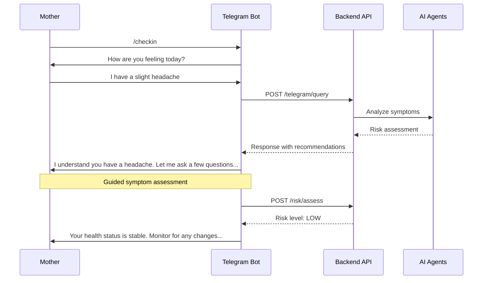
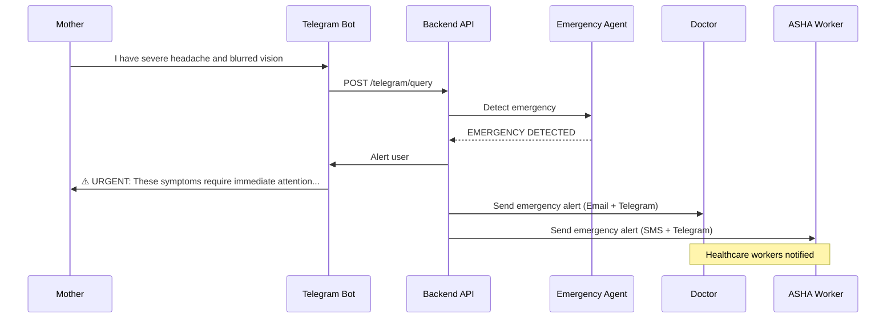

# 📱 Telegram Bot API Endpoints

> Documentation for Telegram bot webhook endpoints and internal API routes for the MatruRaksha Telegram integration.

---

## 📋 Table of Contents

- [Overview](#-overview)
- [Webhook Configuration](#-webhook-configuration)
- [Bot Commands](#-bot-commands)
- [Internal API Endpoints](#-internal-api-endpoints)
- [Message Flow](#-message-flow)
- [Error Handling](#-error-handling)

---

## 🔍 Overview

The MatruRaksha Telegram bot provides 24/7 conversational health support for pregnant mothers. It integrates with the backend API for health monitoring, risk assessments, and emergency detection.

**Bot Features:**
- Daily health check-ins
- Symptom reporting
- AI-powered health consultations
- Medical report uploads
- Emergency detection and alerts
- Multilingual support (upcoming)

---

## 🔗 Webhook Configuration

### Setting Up Webhook

The Telegram bot uses webhooks to receive updates. Configure the webhook with:

```bash
curl -X POST "https://api.telegram.org/bot<BOT_TOKEN>/setWebhook" \
  -H "Content-Type: application/json" \
  -d '{"url": "https://your-backend.com/telegram/webhook"}'
```

### Webhook Endpoint

**`POST /telegram/webhook`**

Receives updates from Telegram Bot API.

**Request Body:** Telegram Update object
```json
{
  "update_id": 123456789,
  "message": {
    "message_id": 1,
    "from": {
      "id": 123456789,
      "first_name": "Priya",
      "language_code": "hi"
    },
    "chat": {
      "id": 123456789,
      "type": "private"
    },
    "text": "/start"
  }
}
```

**Response:** `200 OK` (Empty response required by Telegram)

---

## 🤖 Bot Commands

| Command | Description | Handler |
|---------|-------------|---------|
| `/start` | Welcome message and get chat ID | `start_handler()` |
| `/register` | Start mother registration process | `register_handler()` |
| `/checkin` | Daily health check-in | `checkin_handler()` |
| `/status` | View current health status | `status_handler()` |
| `/timeline` | View health history | `timeline_handler()` |
| `/report` | Report symptoms or concerns | `report_handler()` |
| `/help` | Show available commands | `help_handler()` |
| `/cancel` | Cancel current operation | `cancel_handler()` |

---

## 🔌 Internal API Endpoints

These endpoints are used internally by the Telegram bot service.

### `POST /telegram/send-message`
Send a message to a Telegram chat.

**Request Body:**
```json
{
  "chat_id": "123456789",
  "message": "Your health check-in is due!",
  "parse_mode": "HTML"
}
```

**Response:** `200 OK`
```json
{
  "success": true,
  "message_id": 123
}
```

---

### `POST /telegram/send-alert`
Send an emergency alert to a chat.

**Request Body:**
```json
{
  "chat_id": "123456789",
  "alert_type": "emergency",
  "mother_name": "Priya Sharma",
  "risk_level": "HIGH",
  "symptoms": ["severe headache", "blurred vision"],
  "action_required": "Seek immediate medical attention"
}
```

---

### `POST /telegram/send-reminder`
Send a scheduled reminder.

**Request Body:**
```json
{
  "chat_id": "123456789",
  "reminder_type": "daily_checkin",
  "message": "Good morning! It's time for your daily health check-in. How are you feeling today?"
}
```

---

### `GET /telegram/chat/{chat_id}/profile`
Get mother profile by Telegram chat ID.

**Response:** `200 OK`
```json
{
  "mother_id": 1,
  "name": "Priya Sharma",
  "phone": "9876543210",
  "current_week": 28,
  "risk_level": "LOW",
  "doctor": "Dr. Meera Shah",
  "asha_worker": "Seema Patil"
}
```

---

### `POST /telegram/process-document`
Process an uploaded document (medical report).

**Request Body:**
```json
{
  "chat_id": "123456789",
  "file_id": "telegram_file_id_xxx",
  "file_type": "photo"
}
```

**Response:** `200 OK`
```json
{
  "success": true,
  "report_id": "uuid",
  "analysis_summary": "Blood report analyzed successfully...",
  "recommendations": [...]
}
```

---

### `POST /telegram/query`
Process a natural language query through AI agents.

**Request Body:**
```json
{
  "chat_id": "123456789",
  "query": "What foods should I eat to improve my hemoglobin?",
  "language": "en"
}
```

**Response:** `200 OK`
```json
{
  "response": "Based on your current hemoglobin levels, here are iron-rich foods...",
  "agent_used": "nutrition_agent",
  "follow_up_actions": []
}
```

---

## 🔄 Message Flow

### Health Check-in Flow



### Emergency Detection Flow



---

## ❌ Error Handling

### Common Error Responses

**User Not Registered:**
```json
{
  "error": "user_not_found",
  "message": "Please register first using /register command"
}
```

**Rate Limited:**
```json
{
  "error": "rate_limited",
  "message": "Too many requests. Please wait a moment."
}
```

**Service Unavailable:**
```json
{
  "error": "service_unavailable",
  "message": "Service temporarily unavailable. Please try again later."
}
```

---

## 🔧 Environment Variables

Required for Telegram bot:

```env
TELEGRAM_BOT_TOKEN=your_bot_token_from_botfather
BACKEND_API_BASE_URL=http://localhost:8000
```

---

## 📚 Related Documentation

- [Bot Commands Reference](../telegram/bot_commands.md)
- [Telegram Setup Guide](../telegram/telegram_setup.md)
- [Main API Endpoints](./endpoints.md)

---

*Last Updated: January 2026*
